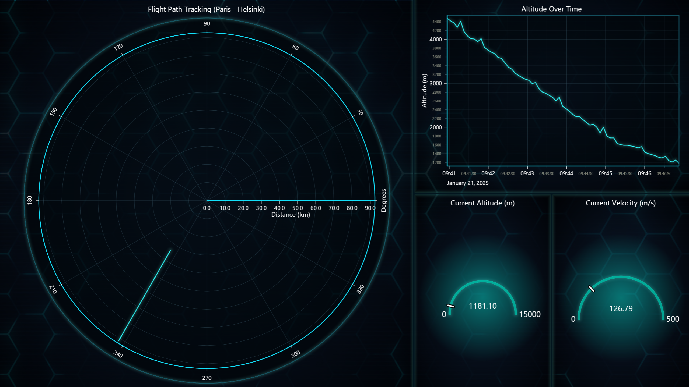

# Creating a Python Flight Tracking Application with State Vector Data

## Introduction

Tracking flights in real time is made straightforward by leveraging structured JSON data provided by modern APIs. This project demonstrates how to build a flight tracking application using **The OpenSky Network API** for fetching state vector data and **LightningChart Python** for crafting dynamic, real-time visualizations.

### What type of data is tracked?

The application tracks essential flight data, including latitude, longitude, altitude, velocity, and ICAO24 identifiers.

### What are state vectors?

State vectors are a set of attributes that describe an aircraft's position and motion at a given time. Key attributes include geographical coordinates, altitude and velocity.

### About the data source

The data is sourced from **The OpenSky Network API** , an open platform providing real-time air traffic information. The API allows access to flight state vectors, which can be filtered by ICAO24, bounding boxes, or country origin.

## Importance of Visualizing Air Traffic in Real-Time

Real-time air traffic visualization is crucial for aviation monitoring, providing insights into:

* **Enhanced situational awareness** : Monitoring aircraft positions, velocity, and altitude in real time.
* **Air traffic management** : Ensuring safer and more efficient airspace usage.
* **Operational insights** : Identifying patterns, delays, or anomalies in air traffic.

## LightningChart Python

### Overview of LightningChart Python

**LightningChart Python** is a high-performance charting library designed for real-time data visualization. It offers:

* Advanced visualization capabilities for dynamic data.
* Optimized performance for handling real-time data efficiently.
* Customization options for various chart types.

## Setting Up the Python Environment

To set up the Python environment for this project, you need to install Python and the necessary libraries such as LightningChart Python and OpenSky Network API.

1. **Install Python**: Download and install the latest version of Python from the [official website](https://www.python.org/).
2. **Install Libraries**: Use `pip` to install the required libraries:
   ```bash
   pip install lightningchart
   ```
3. Set up your development environment by creating a new project directory and installing the required libraries. Ensure that LightningChart Python is properly licensed.

### Installing the OpenSky Network API Library

The OpenSky Network API requires its Python library to fetch state vector data. Install it as follows:

1. Clone or download the repository from [OpenSky Network API Repository](https://github.com/openskynetwork/opensky-api):

   ```bash
   git clone https://github.com/openskynetwork/opensky-api.git
   ```
2. Navigate to the `python` directory and install the library:

   ```bash
   pip install -e /path/to/repository/python
   ```

   Alternatively, you can use pip without the `-e` option if issues occur:

   ```bash
   pip install .
   ```

### Overview of Libraries

* **LightningChart Python** : For high-performance visualizations. ([documentation](https://lightningchart.com/python-charts/docs/))
* **OpenSky Network API** : For fetching state vector data. ([documentation](https://openskynetwork.github.io/opensky-api/index.html))

## Loading and Processing Data

### Overview of the Data

The state vector data includes attributes like ICAO24, callsign, position (latitude, longitude, altitude) and velocity.

### How to Fetch Data

Data is fetched directly from the OpenSky Network API using credentials. Below is an example snippet for fetching state vectors and targeting a specific flight based on its ICAO24 code:

```python
from opensky_api import OpenSkyApi

# Initialize OpenSky API with credentials
api = OpenSkyApi("username", "password")

# Target flight's ICAO24
target_icao24 = "4601f5" # Replace with the desired ICAO24

# Fetch current states
states = api.get_states()

# Find the target flight
for s in states.states:
    if s.icao24 == target_icao24:
        print(f"Tracking {s.callsign}: Lat {s.latitude}, Lon {s.longitude}, Alt {s.geo_altitude}, Vel {s.velocity}, On Ground: {s.on_ground}")
```

## Visualizing Data with LightningChart Python

The dashboard includes a polar chart for visualizing the flight's path relative to a reference point, such as Helsinki Airport. To calculate the data for the polar chart, two helper functions are used: the **Haversine formula** for distance and a **bearing calculation** for direction.

Distance and Bearing Calculations

1. **Haversine Formula** : Calculates the great-circle distance between two geographic points on the Earth's surface, accounting for its curvature.
2. **Bearing Calculation** : Computes the compass direction from the reference point to the target location.

These calculations are essential for plotting the flight's position accurately on the polar chart. Below are the Python implementations of these functions:

```python
def haversine(lat1, lon1, lat2, lon2):
    R = 6371  # Earth radius in kilometers
    dlat = radians(lat2 - lat1)
    dlon = radians(lon2 - lon1)
    a = sin(dlat / 2) ** 2 + cos(radians(lat1)) * cos(radians(lat2)) * sin(dlon / 2) ** 2
    c = 2 * atan2(sqrt(a), sqrt(1 - a))
    return R * c

def calculate_bearing(lat1, lon1, lat2, lon2):
    dlon = radians(lon2 - lon1)
    y = sin(dlon) * cos(radians(lat2))
    x = cos(radians(lat1)) * sin(radians(lat2)) - sin(radians(lat1)) * cos(radians(lat2)) * cos(dlon)
    return (degrees(atan2(y, x)) + 360) % 360

```

By using these functions, the polar chart dynamically updates to show the flight's distance and direction relative to the chosen reference point.

### Creating Charts

1. **Polar Chart** : For flight path tracking relative to a reference point.

```python
polar_chart = dashboard.PolarChart()
polar_line_series = polar_chart.add_line_series()
polar_line_series.set_data(flight_path_data)
```

2. **Line Chart** : To visualize altitude over time.

```python
altitude_chart = dashboard.ChartXY()
altitude_line_series = altitude_chart.add_line_series()
altitude_line_series.add(update_time_ms, altitude)
```

3. **Altitude Gauge** : To display the current altitude.

```python
altitude_gauge = dashboard.GaugeChart()
altitude_gauge.set_title("Current Altitude (m)")
altitude_gauge.set_value(altitude)
```

4. **Velocity Gauge** : To display the current velocity.

```python
velocity_gauge = dashboard.GaugeChart()
velocity_gauge.set_title("Current Velocity (m/s)")
velocity_gauge.set_value(velocity)
```

#### Customizing Visualizations

Visual elements such as titles, axis labels, and themes can be customized:

```python
dashboard = lc.Dashboard(columns=5, rows=2, theme=lc.Themes.TurquoiseHexagon)
polar_chart.set_title("Flight Path Tracking")
altitude_chart.get_default_y_axis().set_title("Altitude (m)")
altitude_gauge.set_bar_thickness(6.0)
velocity_gauge.set_needle_thickness(4.0)
```

#### Streaming and Updating Data in Real Time

Data is updated periodically by fetching the latest state vectors and refreshing the visualizations.

```python
while True:
    states = api.get_states()
    # Update data and charts here
    time.sleep(5)  # Fetch data every 5 seconds
```

#### Displaying Real-Time Data

The dashboard allows visualization with live updates:

```python
dashboad.open(live=True)
```

## API Credit Limitations

When using the OpenSky Network API, keep in mind that it has limitations on API credit usage for both anonymous and registered users. For detailed information about these limitations, refer to the [OpenSky API documentation](https://openskynetwork.github.io/opensky-api/rest.html#limitations).

In this project, we used a registered account to request data without specifying an area, which defaults to global scope and consumes more credits.

API credits are consumed based on the size of the requested area, with larger queries using more credits. For instance, querying a small area (less than 500x500 km) uses fewer credits than querying global data.

## End Result

The final output of this project is a dynamic dashboard that visualizes real-time flight data, including:

* A polar chart showing the flight's path relative to a reference point. We set Helsinki Airport as the reference point here.
* A line chart displaying altitude over time.
* Gauges for real-time altitude and velocity updates.



## Conclusion

This project demonstrates the power of Python for real-time flight tracking by integrating the OpenSky Network API and LightningChart Python. By accessing and processing state vector data, the application visualizes key flight attributes dynamically and effectively. LightningChart Python's real-time rendering and high performance make it an excellent choice for creating robust, customizable visualizations, showcasing its capability to build advanced data visualization tools.
